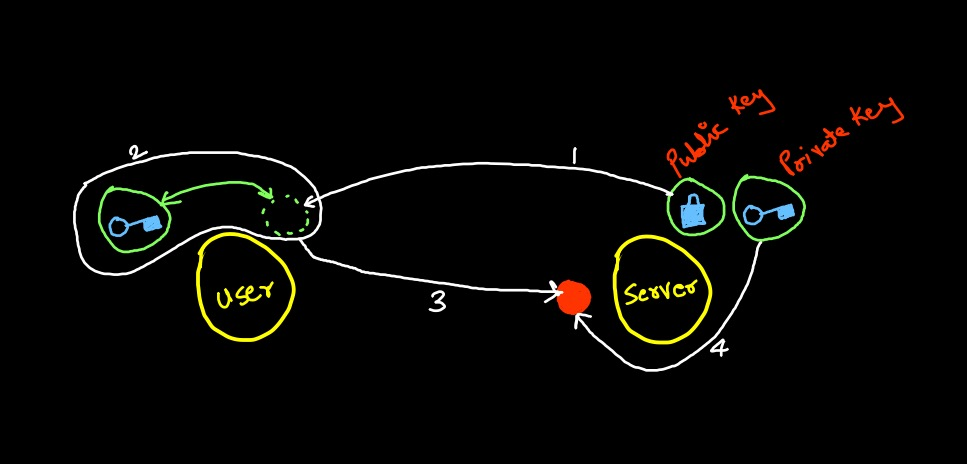

# TLS Certificates

- Needed to gurantee trust between two parties



- **Public Key** : `.pem`, `.crt`
- **Private Keys** : `.key`, `-key.pem`
- Server should have server certificates
- Client should have client certificates
- Every compnent in K8s has a certificate & key it uses.
- Certificate Authority (CA) has their own certificate (ca.cert) & key(ca.key)
- We use CA certs to sign new certificates on creation
- All certificate related operations are carried out by controller manager

## Certificate Creation

- To generate certificates there are different tools [EasyPRSA, OpenSSL, CFSSL]
- We will use OpenSSL
- **CA Certificates:**
  - Generate: 
    ```bash
    openssl genrsa -out ca.key 2048
    ```
  - Certificate Signing:
    ```bash
    openssl req -new -key ca.key  -subj "/CN=KUBERNETES-CA" -out ca.casr
    ```
  - Sign Certificates
    ```bash
    openssl x509 -req -in ca.csr -signkey ca.key -out ca.crt
    ```
- **Admin User:**
  - Generate:
    ```bash
    openssl genrsa -out admin.key 2048
    ```
  - Ceritificate Signing Request:
    ```bash
    openssl req -new -key admin.key -subj "/CN=kube-admin/O=system:masters" -out admin.csr
    ```
  - Sign Certificates
    ```bash
    openssl x509 -req -in admin.csr -CA ca.crt -CAkey ca.key -out admin.crt
    ```

- ETCD server needs additional certificates for its own communicate called as `peer` certificates
- kubeapisever includes and has etcd certificates, kubelet certificates, ca certificates, tls certificate.
- kubelet certificte is named after its node name.

## View Certificates

```bash
openssl x509 -in /etc/kubernetes/pki apiserver.crt -text -noout
```

## TLS Certificate API

- You can see certificate requests
  ```bash
  kubectl get csr
  ```
- 
  ```bash
  kubectl certificate approve <name>
  ```
-  
  ```bash
  kubectl get csr <name> -o yaml
  ```

- 
  ```bash
  cat <name>.csr | base64 | tr -d '\n' OR
  cat <name>.csr | base64 -w 0
  ```
- 
  ```bash
  kubectl delete csr <name>
  ```
- 
  ```bash
  kubectl certificate deny <name>
  ```

## Kubeconig

- We need authentication while using kubectl. But passing certificate with every command is not a good task
- So, we save these certificate flags `--flags=name.key` inside kubeconfig file
- Context can be defined as user@cluster
- Default context is stored in `current-context` (Under kind)
- 
  ```bash
  kubectl conig use-context <context-name>
  ```
- 
  ```bash
  kube conig view --kubeconfig /path/
  ```

## Kubernetes API Groups

`/metrics`, `/healthz`, `/version`, `/logs`, `/apis`