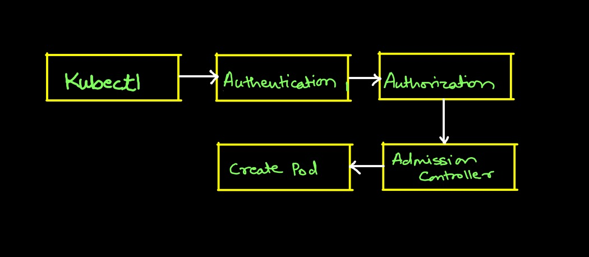
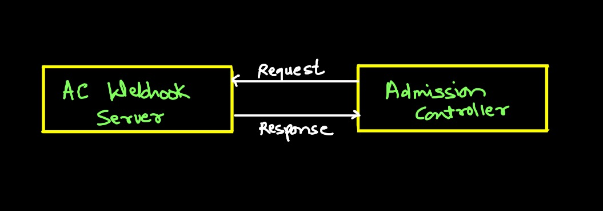

# Admission Controller

- Admision controller helps us to enforce how a cluster is used
- Prebuilt admision controllers in k8s
  - AlwaysPullImages
  - DefaultStorageClass
  - EventRateLimit
  - NamespaceExists
  - Etc
- We can view enabled admission controllers in api server config
- Update admission controllers at flag `--enable-admission-plugins`
- To disable, ue flag `--disable-admission-plugins`



- Admission controller is ued to validate requets from user

## Validating & Mutating Admission Controllers

- To create your own admiion control logic you are provided with "MutatingAdmision Webhook" and "ValidatingAdmision Webhook"



```yaml
apiVersion: admissionregistration.k8s.io/v1
kind: ValidatingWebhookConfiguration
metadata:
  name: "pod-policy.example.com"
webhooks:
- name: "pod-policy.example.com"
  clientConfig:
    service:
      name: "webhook-ns"
      namespace: "webhook-svc"
    caBundle: "xxxx"
  rules:
  - apiGroups: [""]
    apiVersions: ["v1"]
    operations: ["CREATE"]
```

## Lab Learnings

- Create tls ecrets from cert & Key
```bash
k create secret tls <name> --cert=cert/location --key=key/location
```
