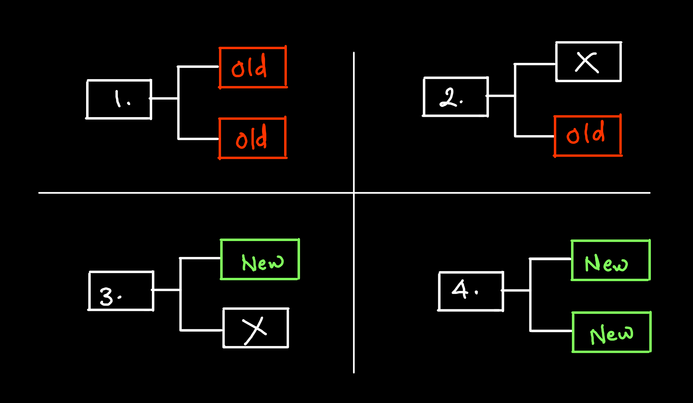
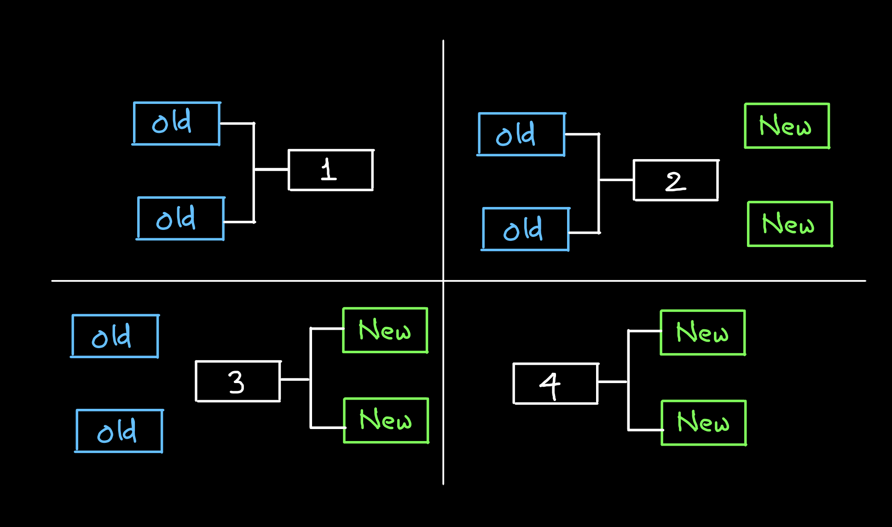
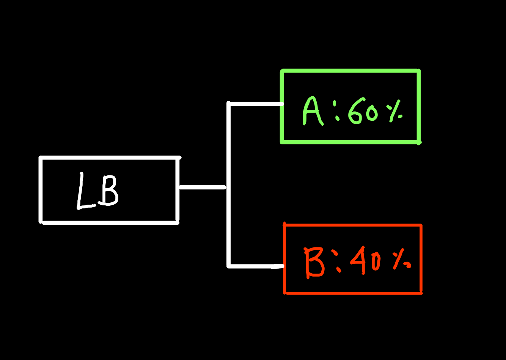
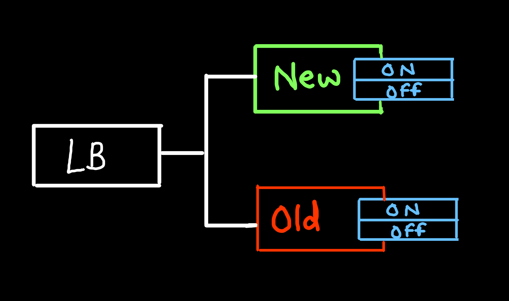

# Deployment Strategies

## Deployment Strategies
- It is a way to change or upgrade an application

## Rollout:
Update server with new version

## Rollback:
Revert recently updated servers back to previous

## Recreate:
- Terminate all running instances and recreate with new version.
- Users experience downtime
- Can be fast * simple
- Rollback is not possible
- Ideal for non-production workloads
```yaml
spec:
    replicas: 3
    strategy:
        type: Recreate
```
## Rolling Updates:
- Rolling updates slowly replace pod one by one
- This is default strategy of Kubernetes
- Reduced availability might happen
- Rollback are slow and hard
- Deploys will be slow
```yaml
spec:
    replicas: 3
    strategy:
        type: RollingUpdate
        rollingUpdate:
            maxSurge: 2
            maxUnavailable: 0
```



## Canary:
- Deploy a new version of app into new pod and serve it to a subset of existing users
- If no-bug then replace old pods
- Fast rollout
- Slow rollback
- No drop in availability

## Blue Green:
- Completely create a new environment of all compnents
- Send traffic to new environment if okay then terminate old (blue)
- Gree are new env
- Blue are old env
- Zero downtime
- No reduced availability
- Slow to deploy but faster than canary
- Instantly rollback to previous infra



## A:B  testing or Red/Black
- Uses canary or Blue Green method of deployment but serves the new app to subset of users based on a set of load balancing rules
- Intentiion for long-period of time



## Dark Launches:
- Feature on a subset of users
- Turn neew feature on and off



## Commands:
```bash
kubectl rollout history deploy/<name>
```
```bash
kubectl rollout status deploy/<name>
```
```bash
kubectl rollout undo deploy/<name>
```