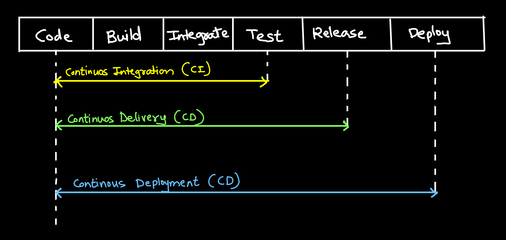

# GitOps and CI/CD

## GitOps:
- GitOps is when you take IaaC and you use git repository to introduce a formal process to review and accept changes to Iaac.

## CI/CD:
- Production (prod) is live server which paying customers use to access your product
- Staging is private server for final testing at customer (QA)

