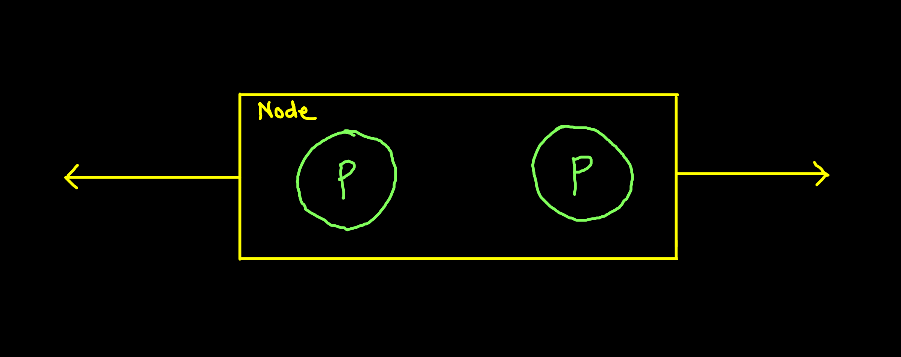
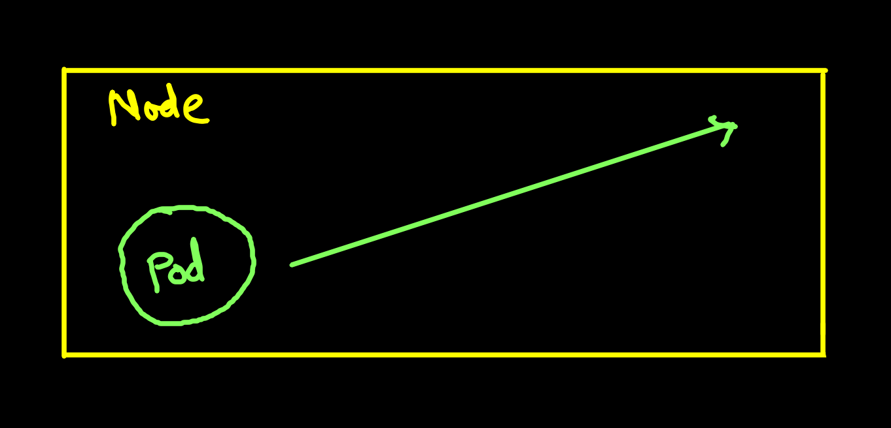
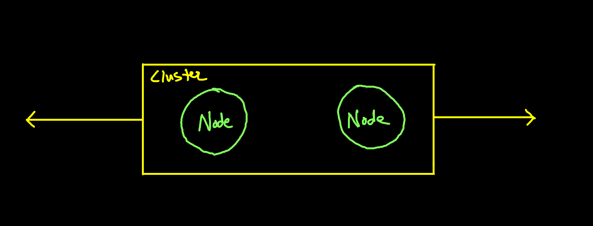

# Autoscaling

In computing, autoscaling is when systesm without manual intervention adjust capacity to meet the traffic demand by adding or removing resources.

## Pod Based Autoscaling

There are two ways in which pod based autoscaling can be used
- Horizontal Pod Scaling (Add more pods)
- Vertical Pod Scaling (Increase CPU, memory capacity)

### Horizontal Pod Scaling:
In this method we increase or decrease the number of pods in the node based on demand



### Vertical Pod Scaling:
In this method we increase or decrease the capacity/size of resources like CPU, Memory etc based on demand




## Node Based Autoscaling:
- Known as ClusterAutoscalar or Karpenter
- We increase or decrease the number of nodes based on demand



## Scale V/S AutoScale
- Scale :
    - Update the amount of replicas in the state of deployment object
    - Perform Deploy
    ```bash
    kubectl scale --replicas=3 deploy/<app-name>
    ```

- Autoscale:
    - The autoscale command is used to create a HorizontalPodAutoScalar
    ```bash
    kubectl autoscale rc --min=1 --max --cpu-percent=80
    ```

## KEDA - Kubernetes Event Driven AutoScaling
- Active MQ
- Apache Kafka
- AWS CloudWatch/ Kinesis/ SQS Queue
- Azure App insights/ Blog Storage/ Event Hubs/ Log analytic/ Monitor/ Pipeline
- New relic
- Prometheus
- Datadog

