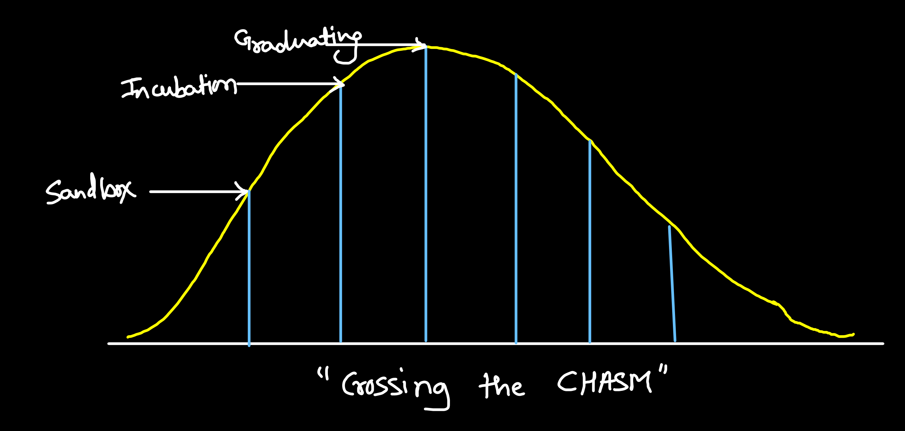

# Community and Governance

## Governance
CNCF Governance boadies are divided into 3 sub parts

1. **Governing board:**
    - Responsible for marketing
    - Other business oversights
    - Budget decisions
2. **Techincal oversight committee (TOC):**
    - Defining & Maintaining technical vision
    - SIG are part of this
3. **End User Community (EUC):**
    - Providing feedback from startups to improve ecosystem
    - End user groups & Usergroups like CNCF Nashik

## Membership
- Platinum members
- Gold member
- Silver member
- End user members
- Academic & Non-profit members

## End user Technology Radar
Get Feedback from community to find out recommended and preferred tool. Components are:
1. Assess (Tried it, looks promising)
2. Trial (Can have closer look)
3. Adopt (Clearly recommed it)

## CNCF Charter:
It's a big document to help define and guide CNCF.
eg: Mission, org structure, policies etc.

## CNCF Values:
- faster is better than slow
- Open
- Fair
- Strong technical identity
- Clear boundries
- Scalable
- Platform agnostic

## CNCF Project:
Built by external tech companies. A CNCF project goes through some stages, the following diagram shows the steps in gradully increasing order.

