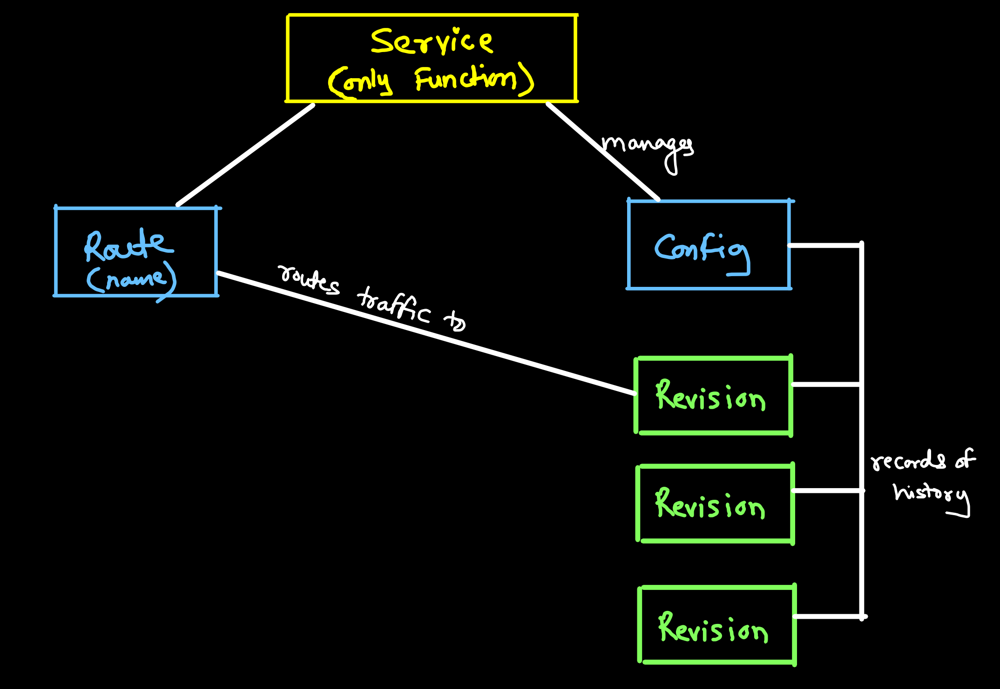

# Serverless

- Serverles architecture generally describes fully managed cloud services
- The classifiction of a cloud service being serverless is not boolean answer (yes or no)
- Answer is on scale where cloud service has degree of serverless

## Characteristics
- Higly scalable
- Higly available
- Higly Durable
- Secure by default
- Billed based on business tasks
- Can scale to zero
- Pay for value (You don't pay for ideal server)

## Function as a Service (FaaS):
- Allows developers to focus on just writing pieces of code (functions)
- Generally multiple functions are orchastrated together to create a serverless app.
- Functions only run when needed

### 1. OpenFaaS:
- Runs serverless function anywhere Docker runs

### 2. Faasd:
- It is light weight version of OpenFaaS that doesn't need Kubernetes to run.
- It can run on single under-powered machine

### 3. Apache OpenWisk:
- Deploy to Kubernetes, Mesos, Docker Swarm

## KNative:
- Kubernetes-based platform to deploy and manage modern serverless workloads
- KNative is a project to create a standard set of building blocks for kubernetes to enable serverless deployment patter
- KNative generally is composed of two parts
    - **KNative serving**: 
        - Take containerized code and eploy it with relative ease
        - Scale to zero cost
    - **KNative Eventing**:
        - Trigger serverless function based on K8s API events.
- **Considerations:** 
    - Not a complete serverless function
    - It does not offere FaaS offereingd

- **KNative defines its own set of Kubernetes objects as kubernetes custom resource definitions (CRDs)**

- **KNative Components:**
    - Service
    - Route
    - Configuration
    - Revision
- KNative uses its own CLI called `kn` used alongside `kubectl`

💡 You should definitly read about `KNative v/s OpenFaaS` once

