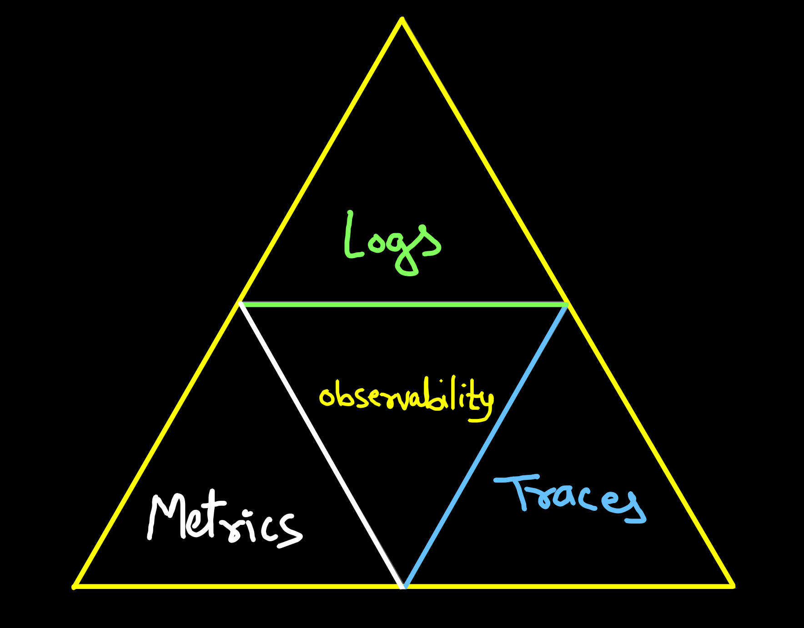
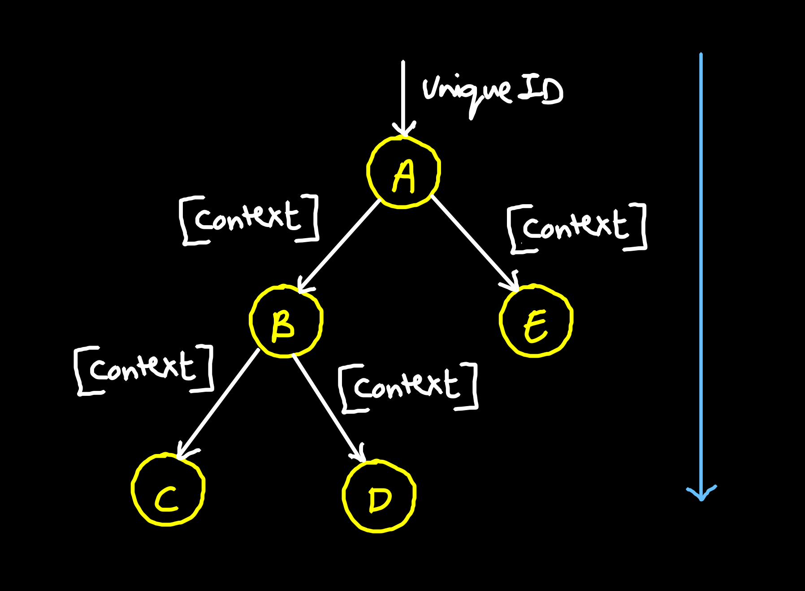
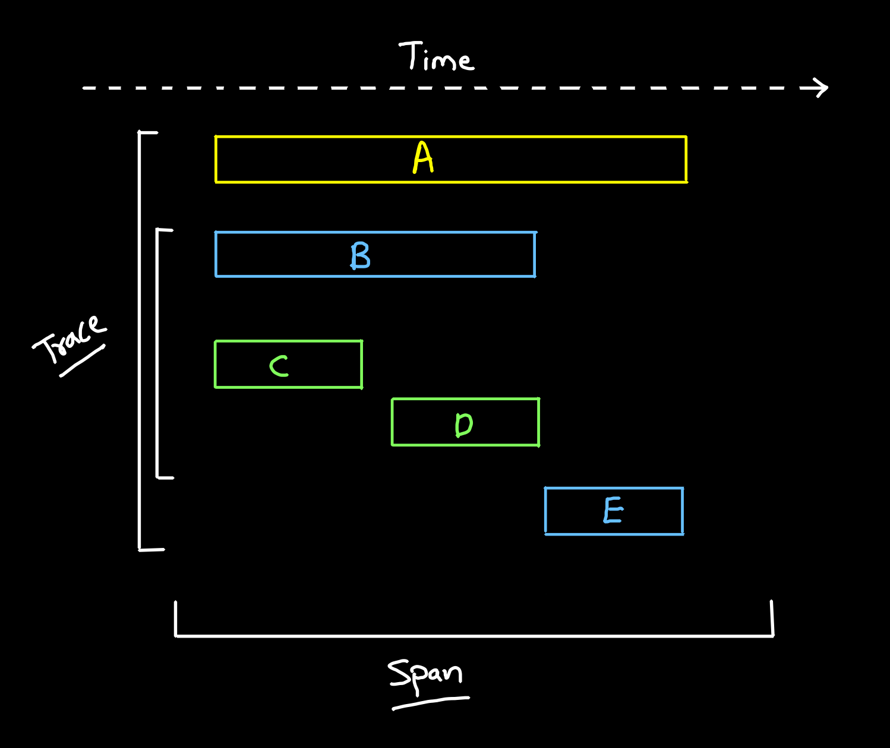

# Observability

## Oberservability:
- The ability to understand, measure how internal systems work in order to ensure questions regarding application.
- To obtain obervability, you need to use ***Metrics, Logs, and Traces***

## Metrics:
A number that is measured over period of time

## Logs:
A text file, containing event data about what happened at certain time

## Traces:
A history of requests that it travels through multiple apps/services so we get pin-point performance



## OpenTelemetry - Instrumentation
- OpenTelemetry is standardize the way telemetry data (metrics, logs & traces) are generated and collected
- Wire Protocol: A wire protocol referes to a way of getting data from point-to-point
- Instrumentation: it is act of embedding a monitoring library into your existing application in order to capture monitoring data such as: metrics, traces or logs
- OpenTelemetry collector is a agent installed on the target machine, as a dedicate server and is ***vender-agnostic*** way to receive, process and export telemetry data
- The local collector agent is the default location to which instrumentation libraries export their telemetry data


## Prometheus
- Prometheus is an open-source systems monitoring and alerting tookit originally built at SoundCloud
- Prometheus is ***time-series database***
- Prometheus values reliability
- You can always view that
- Prometheus is not correct choice if you want 100% accuracy


## Grafana:
- Grafana is open source analytics and interactive visualization web application
- Grafana is commonly used along with a time series database like: influxDB, Prometheus or Graphite


## Traces & Spans
- A trace is a data/ execution path through the system, and can be thought of as directed acyslic graph (DAG) of spans
- A span represents a logical unit of work in Jaeger that has an operation name, start time of the operation and the duration





## Kubernetes System logs & Klogs:
### System Logs:
- HTTP access logs, pod state changes, controller action, or scheduler decision
- In `kubectl`` you can view logs with `logs` command

```bash
kubectl logs nginx --all-containers=true
```

### Klogs:
- Klogs is the Kubernetes logging library
- Klogs generates log messages for kubernetes system components

## Testing:
Asserting the expectations of the input and output of the function

## What is Chaos Testing?
Building system to withstand and tolerate any kind of failure by purposly introducing random failures in production systems
- ChaosKube
- TestKube
- ChaosMonkey