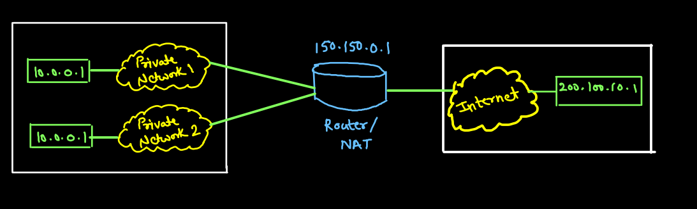
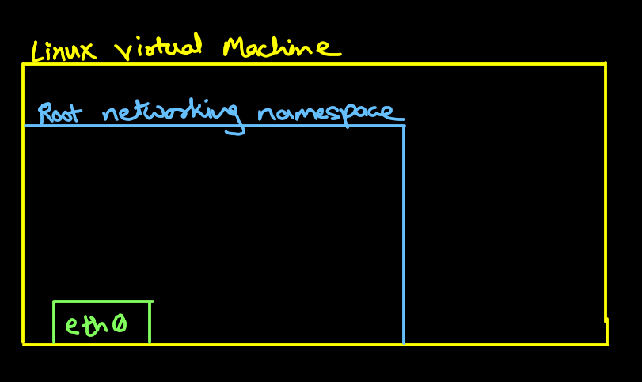
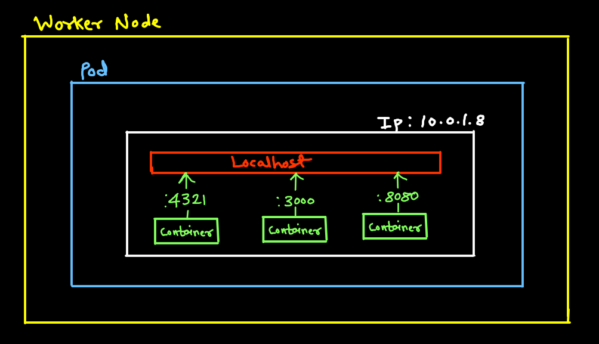
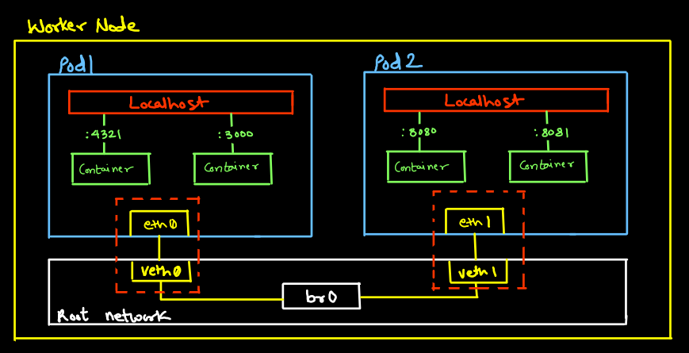
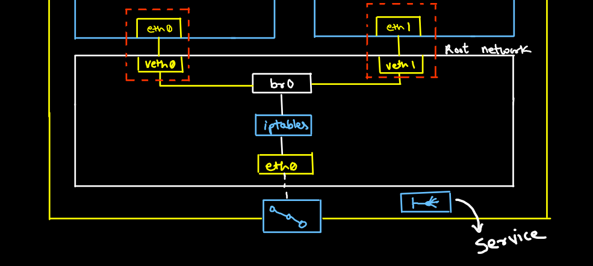

# Cluster Networking

## NAT (Network Address Translation)
Imagine you have a big house with a lot of rooms. Each room has a different address, so people know where to go. But if you have too many rooms, it can be hard to remember all the addresses. That's where network address translation (NAT) comes in.

NAT is like a big switchboard that keeps track of all the rooms in your house. When someone wants to go to a room, they don't need to know the address. They just need to know the name of the room. The switchboard will then look up the address for them and send them on their way.

NAT works the same way for computers on the internet. Each computer has a unique address called an IP address. But there are only so many IP addresses available, so NAT lets you use one IP address for many computers.

When a computer on your network wants to go to the internet, it sends a message to the NAT switchboard. The switchboard will then look up the IP address for the computer and send the message on its way.

NAT is a very important part of the internet. It helps to conserve IP addresses and makes it easier for computers to communicate with each other.

## Eth0:
- Ehernet devices allows server to communicate on computer network
- Cloud service providers, have vitual NICs for your virtual machines (VMs) to connect ot virtual network

## Netoworking namespace:
- `eth0` represents first Ethernet interface attached to your virtual machine
- Linux by default has one network namespace called `Root`
- Use `ifconfig` to observe `eth0`
- Use `ip netns` to create or modify or view network namespace

## Cluster Networking:
K8s has following options about cluster networking:
- All pods can communicate with all other pods _without NAT_
- All nodes can communicate with all pods without _using NAT_

Nat can be used in K8s even though there are above contradictions.

**4 Broad type of network communication**
1. Container-to-Container
2. Pod-to-pod
3. Pod-to-Service
4. External-to-Service

## Container to Container networking
- Container all in the same pod have the same IP address & port space.
- Containers can communicate with each other via localhost via different ports

## Virtual Ethernet Devices (Veths):
- They can act as tunnels between network namesapce to create a bridge to physical network devices in another namespace
- Packets on one device in the pair are immediately received on the other device
- Veth devices are always created interconnected pairs

## Pod to Pod Networking
- In the Root network namespace a bridge is used to allow all Pod Network namespaces to talk to other pods
- Touting allows multiple networks to communicate independently and yet remain seperate using router
- Bridging connect two seperate networks as if they were a single network using a bridge

## Pod to Service Networking
A service creates a virtualised IP and then uses IPtables for loadbalancing to other pods. So when pod dies IP is lost with it so we need static IP.

