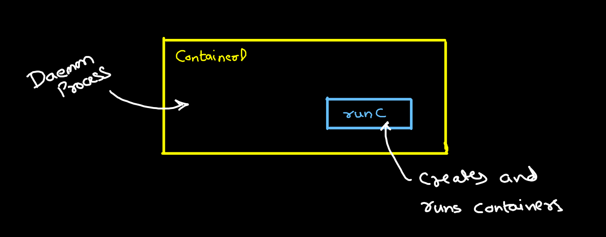

# Container Runtime

## Container Runtime:
- runC is a low-level container runtime that create & run containers
- runC would be used alongside ContainerD or CRI-O

## CGroups:
- Process: A process an instance of running program on linux.
- CGroup allows to apply different kinds of limitations
    - Resource limiting
    - Prioritization
    - Accounting
    - Control