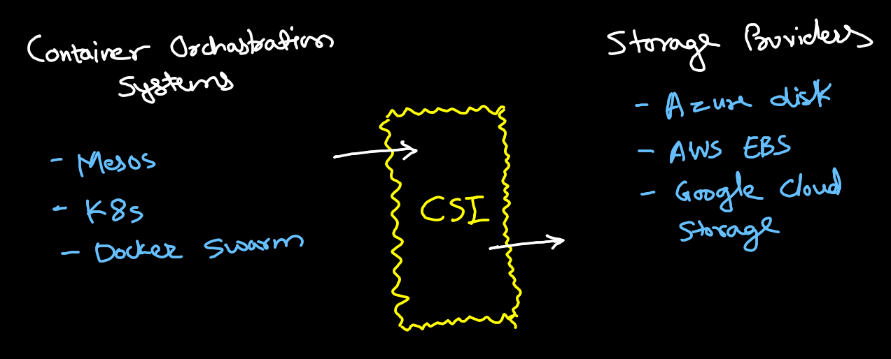
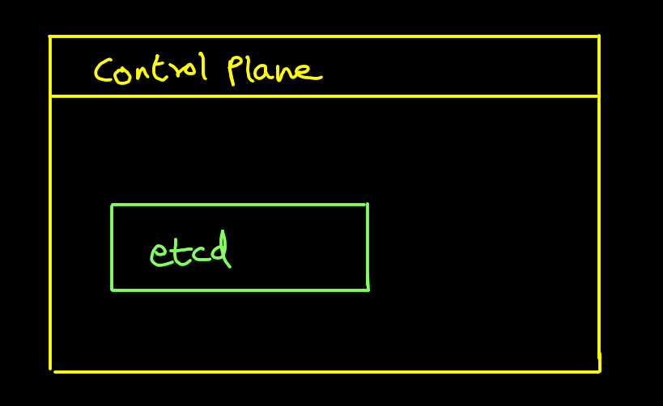

# Container Storage

## Container Storage Interface (CSI):
- CSI standardizes how orchastration systems access to various storage providers.

##  Kuberenets Backing Store and etcd:
- Components of K8s cluster each needs level of protection in case of disaster.
- K8s resources are stored in an etcd (can be backed by MariaDB)
- etcd is a strongly consistent, disctributed key-value store that provides a reliable way to store data that needs to be accessed by distributed systems.
- Things that use etcd:
    - K8s
    - CoreDNS
    - Rook

## Rook:
- It automates the tasks of storage administrators
- It turns distributed storage system into self managing, self-scaling, self-healing storage service

## MinIO:
- Offers high performance, S3 compatible object storage
- Native to k8s, MinIo is the only object storage suite available for cloud
- It is open sourced under GNU license

