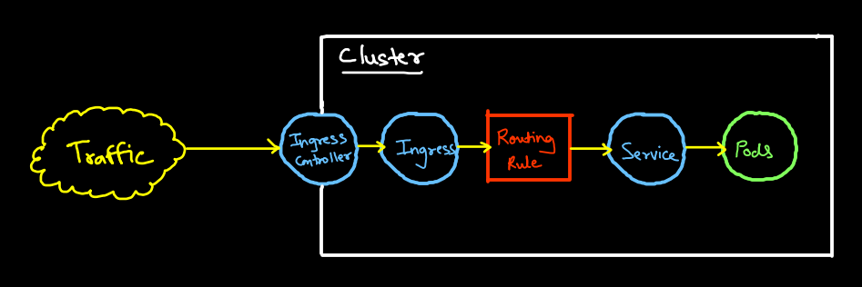
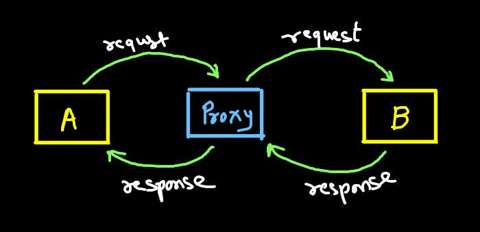
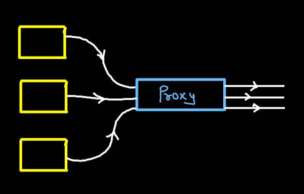
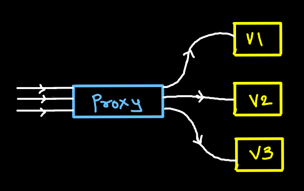
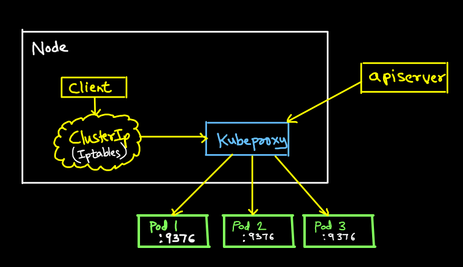
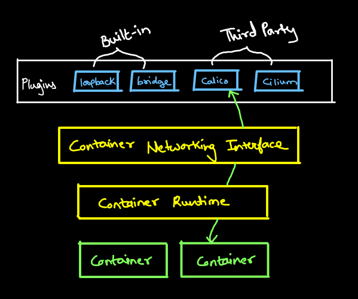
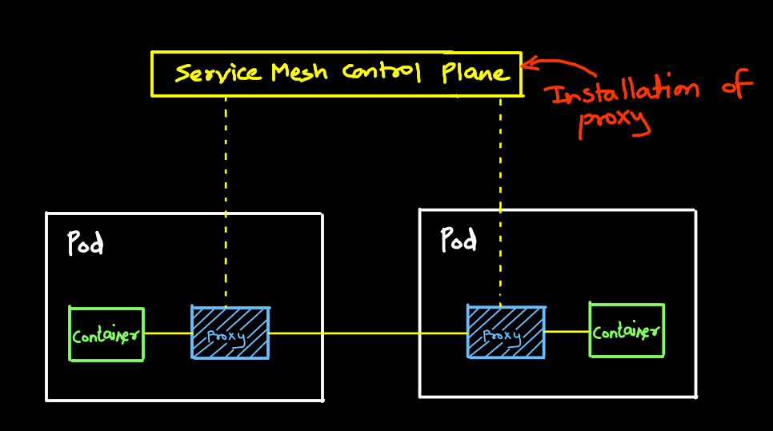

# Networking 

## Kubernetes Ingress:
The reason we use a K8s ingress is so we can translate a custom domain on SSL to service running within our K8s cluster



## DNS
- It is a service that is responsible for translating (or resolving) a service name to it's ip address
- CoreDNS is the default DNS server for Kubernetes
- It ensures pods and services have fully qualified domain name (FQDN)
- CoreDNS Plugins:
    - Internal Plugins:
        - acl
        - any
        - cache
        - health
        - log
    - External Plugins:
        - git
        - alias
- Each pod has `resolv.conf` file to help with DNS resolving

## Probes:
Probes are used to detect the state of a container.
1. Liveness Probe: When restart container.
2. Readiness Probe: When container is ready to accept traffic.
3. Startup Probe: When container application has started.

## Netfilter:
This project enables 
- Packet filtering
- Network address & port translation
- packet logging & queing

Projects built on top of Netfilter
- Iptables (Current default)
- Nftables
- IPVS

## Userspace:
Operating system segregates virtual memory into kernel space and user space.
- KS: Priviledged kernel operation etc
- US: Application software & other drivers

## Ip tables:
- Iptables is a user-space utility program that allows a system administrator to configure the IP packet filter rules of the Linux kernel firewall
- Ip tables are simply virtual firewalls on linux
```bash
iptables -|INPUT | -p tcp -dport 80 -j ACCEPT
```
- Iptables are default for kubeproxy

## IPVS:
- iptables struggle to scale as its bottlenecked to 5000 nodes per cluster
- IPVS is specially designed for load balancing and uses more efficient data structures (hash tables) for scaling under the hood.
- In future this will be default for kubeproxy

## Various Proxy
**Proxy:**  A server application that acts as a intermediary between a client requesting a resource and the server providing that resource

 

**Types of proxies in Kuberentes:**
- kubectl proxy (Localhost address to k8s api server)
- Apiserver proxy (Connect user outside cluster with cluster IP)
- kubeproxy (Used to reach services)
- Proxy/loadbanacer (Acts as loadbalancer if several apiservers)
- Cloud load balancer (for external traffic to reach pods)

## Forward Proxy:
- Default proxy
- Bunch of server egressing traffic have to pass through the proxy first



## Reverse Proxy:
Ingress traffic trying to reach a collection of servers



## Kube-Proxy:
- Kube-proxy is network that runs on each node in your cluster. 
- It is designed to load balance traffic to pod.
- Maintains network rules on nodes
- Kubeproxy uses operating systems packet filtering layer else kube-proxy forwards the traffic itself
- Kubeproxy can run in three modes:
    - Iptables (Default)
    - IPVS (Future default)
    - Userspace (Legacy)



## Container Networking Interface (CNI):
It is specification for writing plugins to configure networking interface for linux containers.



## Service Mesh
- A service mesh manages service-to-service communication of microservice architecture.
- Service mes provides:
    - Reliability
    - Observability
    - Security
- Service mesh uses ***side car pattern***
- A proxy container is installed in each pod.
- Application container must pass through the proxies
- Istio, Kuma, Linkerd



## Envoy
- Envoy is self contained process that is designed to run alongside every application server
- Can be installed as VM or as a container
- In practice use don't manually configure Envoy
- You would allow service mesh control plane to install it into pods
- Service mesh may come up with UI for envoy configuration