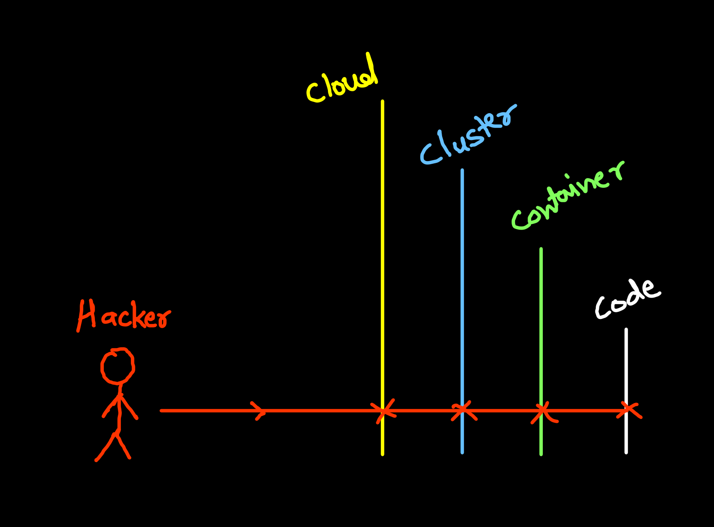
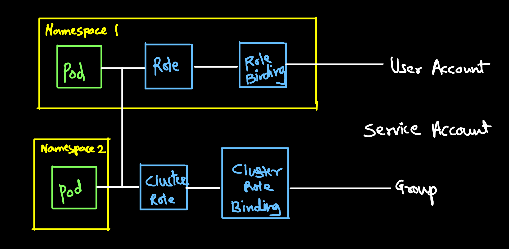
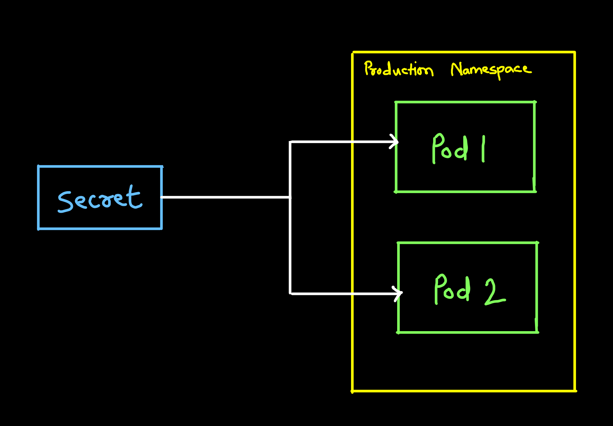
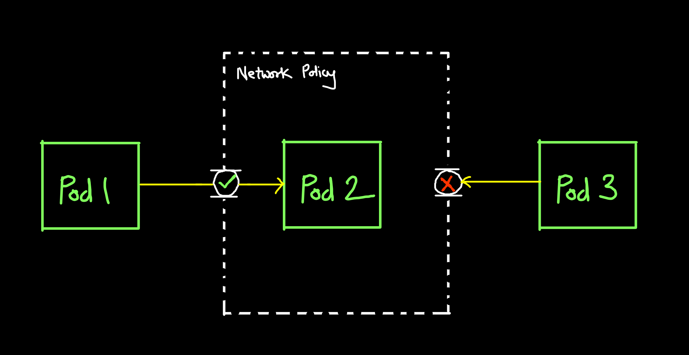

# Security

## 4C of Cloud Native Security
Stands for
1. Cloud
2. Cluster
3. Container
4. Code

Each layer of cloud native security model builds upon next outermost layer



## Cloud Layer Security:
- It is known as base layer
- Base on managed or self managed infrastructure

- Managed Infrastructre (IaaC):
    - Cloud Service Providers
    - Cloud paltforms
- Self-Managed
    - Co-located servers
    - Cooperate Datacenter

## Cluster Security:
Two parts to cluster layer security

1. Components _of the cluster_:
    - Controlling access to Kubernetes API
    - Controlling access to the kubelet
    - Controlling the capabilities of a workload or user at runtime
    - Protecting cluster componets from compromise

2. Component _in the cluster_:
    - RBAC Authorization
    - Authentification
    - Application secret management
    - Ensuring that pods meed defined Pod Security Standards
    - Quality of service
    - Network Policies
    - TLS for Kubenetes Ingress

## Container Layer:
- Container vulnerability scanning and OS dependency security
- Image Signing and enforcement
- Disallow privilege users
- Use container runtimes with stranger isolation

## Code Layer:
- Access over TLS only
- Limiting part ranges of Communication
- 3rd party dependency security
- Static code analysis
- Dynamic probing attack

## Infrastructure security
- Network access to API server:
    - All access to K8s control plane is not allowed publicly on the internet,
    - Congtrolled by list of restricted IP's
- Network access to Nodes:
    - Only accept connections from the control plane on specified ports
    - Accept connections from services in kubernetes of type NodePort and Loadbalancer.
- Kubenetes access to Cloud Providers API:
    - Grant diffent permission to kubernetes control plane and nodes
- Access to etcd:
    - Access to etcd should be limited to controle plane only
    - You should attempt to use etcd over TLS
- Etcd encryption:
    - Encrypt all storage at rest
    - etcd holds the state of entire cluster (including secretes). It's disk should be expecially encrypted

## AAA
Authentication, Authorization, Accounting

- Authentication (to identify):
    - Static password
    - one time password
    - Digital certificates
    - Basic Auth

- Authorization (to get permission):
    - Role Based Access Control (RBAC)

- Accounting (to log and audit trail)
    - Audit policies
    - Audit backends (where logs are stored)

## RBAC - Role Based Access Control
- RBAC is a way of defining permission for identities based on a organisational role.
- RBAC uses the `rbac.authorization.k8s.io` API group to drive authorization decisions
- Enable RBAC:
```bash
kube-apiserver --authorization-mode=RBAC
```
- With K8s RBAC there are _only allow rules_ that means everything is deny by default

## Types of RBAC
- There are 4 types of RBAC objects
    - Role
    - RoleBinding
    - ClusterRole
    - ClusterRoleBinding
- A `Role` is a set of permissions of a particular namespace
- `ClusterRole` sites permission accross all namespaces
- `RoleBinding` and `ClusterRoleBinding` link permission to the subject
    - User Account (Single user)
    - Service Account (Machine User)
    - Group (Group of single or machine)



## Role Configuration:
```yml
apiVersion: rbac.authorization.k8s.io/v1
kind: Role
metadata:
  namespace: default
  name: pod-reader
rules:
- apiGroups: [""] # "" indicates the core API group
  resources: ["pods"]
  verbs: ["get", "watch", "list"]
```

## Secret Management:
A secret is similar to a configMap with the exception that can be encrypted

By Default secrets are _unencrypted_ in etcd store
- Anyone with access to the etcd store has access to the secret
- Anyone who has access to pod within namespace which have access to the secrets used by pod

**How to keep Secrets Safe**
- Encrypt the secrets (Maybe with RBAC)



## Networking Policies:
- Network policies act as virtual firewalls for pod communication
    - Pod-to-pod
    - Namespaces
    - Specific IPs
- Selectors are used to determine to select resources with matching labels for the network policy to be applied to.
- Network plugin you are using must support network policies eg: Calico, Weavenet, Cilium etc



## Calico:
Calico is an open source network and network security solution for conainers, VMs, native host-based workloads

Calico supports range of platforms:
- Kubernetes
- OpenShift
- Mirantis Kubernetes Engine
- OpenStack
- Bare Metal Services

Calico gives you choice of dataplane
- Linux eBPF
- Standard Linux
- Windows HNS

## Anatomy of Network Plicy File
- For network policy you'll specify either a pod selector or namespace selector
- You can define Ingress rules (Permitted traffic entering pod)
- You can define Egress rules (Permitting traffic exiting pod)

## In-transit Encryption
Data that is secure when moving between location alogirthms
- TLS (Transport Layer Security)
- SSL (Secure Socket Layer)

## At-rest Encryption
Data that is secure when residing on storage or within a database algorithm
- AES (Advanced Encryption Standard)
- RSA (Rivest-Shamir-Adleman)

## Certificates and TLC:
- Kuberneetes provides `certificates.k8s.io` API, which lets you provision TLS certificates signed by the Ceritificate Autority (CA)
- These CA and certificates can be used by your workloads to establish trust

## Public Key Interface (PKI):
- PKI is a set of roles, hardware, software & procedures needed to create, manage, distribute, use, store and revoke digital certificates and manage public key encryption.
- `x.509` is used in many internet protocol:
    - SSL/TLS
    - HTTP
- Kuberenetes requires PKI for several operations
- These are stored in `etc/kubernetes/pki`

## K8s Security Best Practices
1. Enable K8s RBAC
2. use third Party Authentication for API server
3. Protect etcd with TLS, firewall, and encryption
4. Isolate K8s nodes
5. Monitor network traffic to limit communication
6. use process whitelisting
7. Turn on audit logging
8. Keep K8s version up to date
9. Lock-down `kubelet`
