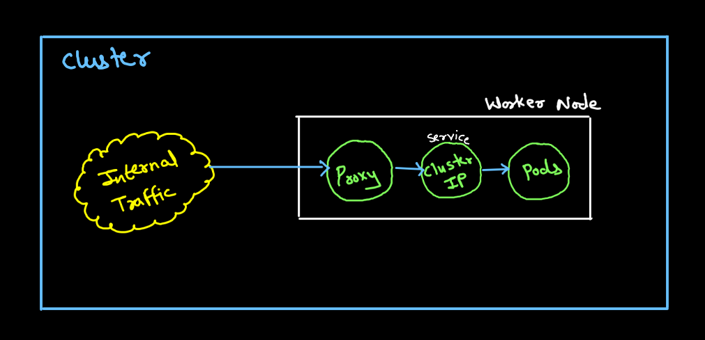
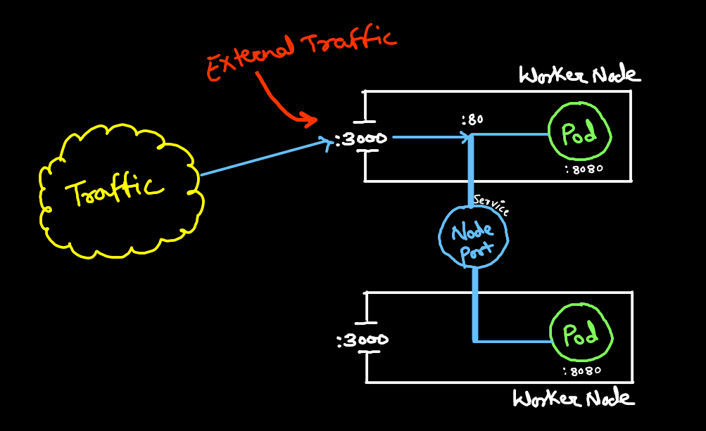
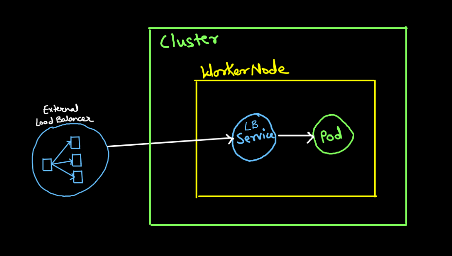
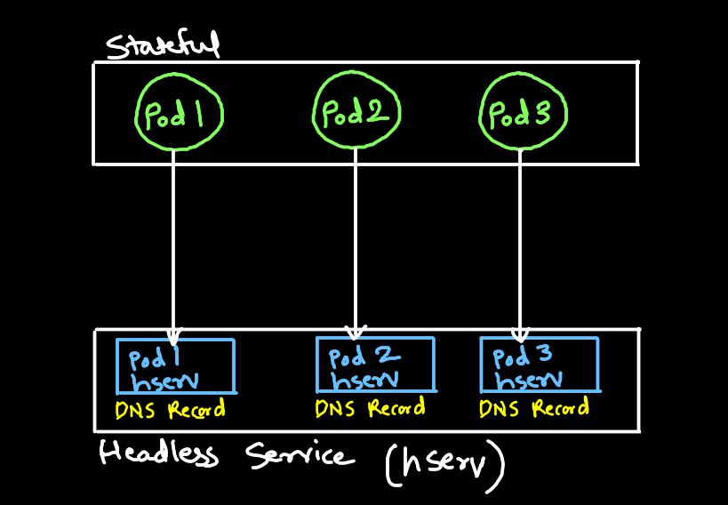
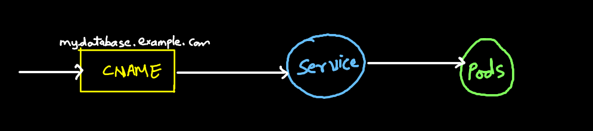

# K8s Services
- K8s service allows you to attach a static Ip address and DNS name for a set of pods
- Services allows you to persist an address for a pod even if it dies.
- Pod without service will have dynamic ip

## Service types:
1. ClusterIP: (Randomly forwar traffic to any pod)
2. Headless: (Traffic to specifi pod eg: database)
3. NodePort: (Uses worker node ip address)
4. LoadBalancer: (Balances the traffic)
5. ExternalName: Service that does not have selectors and uses DNS names instead.

## Services traffic policies
Services allows you to set traffic policies to determine how ingress traffic is routed.

Traffic policies:
- External Traffic policy:
    - Cluster: Route external traffic to all ready endpoints
    - Local: Only route to ready node-local endpoings
- Internal traffic policy:
How traffic from internal sources is routed

If traffic policy is local and there are no node-local endpoints, then kubeproxy does not forward any traffic for the relevant service

## ClusterIP:
- Default service type
- Used for internal traffic



## NodePort:
Nodeport allows you to expose a port for virtual machines running pods that service is managing.
```bash
port: 80
targetPort: 8080
```


## Loadbalancer:
- A loadbalancer service type allows you to use an external load balancer
- Usually managed by third party
- It is well suited for production workloads. Generally to use K8s ingress



## Headless:
- It is a service with no ClusterIP address
- Does not provide load balancing or proxying



## ExternalName:
ExternalName services as the same as ClusterIP service with exception instead of returning staticIP it returns a CNAME records



## Kubectl expose command:
```bash
kubectl expose deployment my-app 
--type=NodePort\
--name=my-svc\
--port=80\
--targetport=8080\ 
--nodeport=3000
```

## Busybox:
- BusyBox combines tiny versions of many common UNIX utilities into single small executable
- Can be used to interactively debug services.
