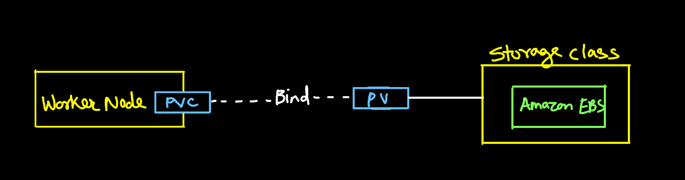
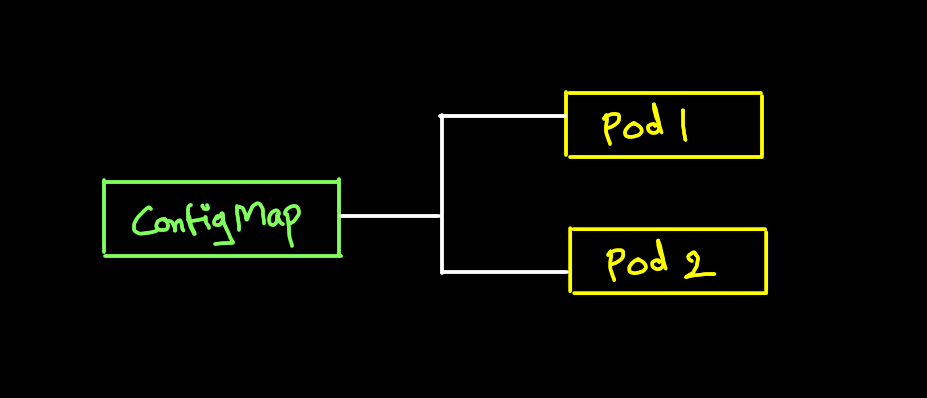

# Volumes

## Volumes:
- Kuberenetes supports many types of volumes
- A pod can use any number of volume types simultaneously

### Types of Volumes:
- Persistent Volumes:
    - Attaching an external storage to a pod
    - Data will persist after pod termination
- Ephemeral Volumes:
    - Only exists as long as pod exists
    - Intended for temporary storage
- Projected Volumes:
    - Maps several existing volumes sources into the same directory
- Volume Snapshot:
    - Achiving a volume configurations and its data for rollbacks or backup


## Persistent Volume:
- A piece of storage in the cluster that has been provisioned by admin
- PV is similar to node, as in cluster resource
- PV does not reside within a node or a pod
- PVs are volume plugins like volumens but have a lifecycle independent of any individual pod that uses the PV.
- Mounting pod directly to a stroage is not allowed

## Storage class:
Storage class contains:
1. Provisioner
2. Parameters
3. reclaimPolicy
```yml
provisioner: kuberenetes.io/aws-ebs
```


## Persistent Volume Claim:
A PVC asked for a type of storage, and if a PV that meets the criteria is matched, the PV is claimed and bound.



## ConfigMaps:
A ConfigMap is api object used to store **Non confidential data** in key-value pairs for pods

